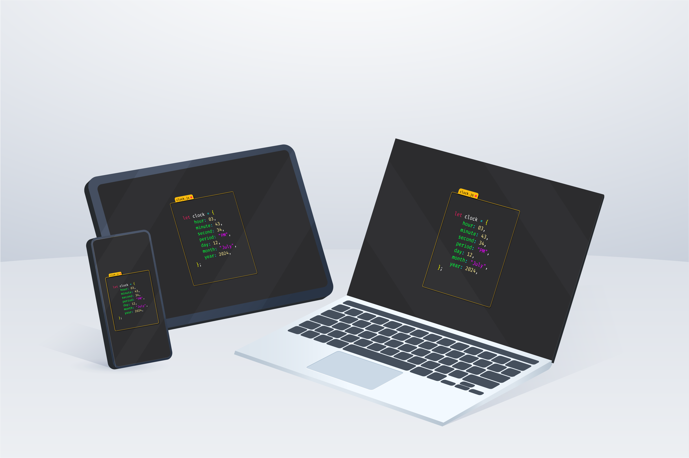

# Aesthetic Clock Website (clock.js)

## Description

This project is an aesthetically pleasing digital clock created using HTML, CSS, and JavaScript. The clock is designed to be visually appealing and provides an accurate display of the current time. The project showcases the seamless integration of front-end technologies to create a functional and attractive web component.

## Features

- **Real-Time Clock**: The clock updates in real-time to display the current hours, minutes, and seconds.
- **Aesthetic Design**: The clock features a modern and clean design, making it suitable for various web applications and personal projects.
- **Responsive Layout**: The clock is designed to be responsive, ensuring it looks great on different devices and screen sizes.

## Demo

You can view the live demo of the aesthetic clock [here](https://devanshtyagi26.github.io/Clock.js/).

## Author

Devansh Tyagi
